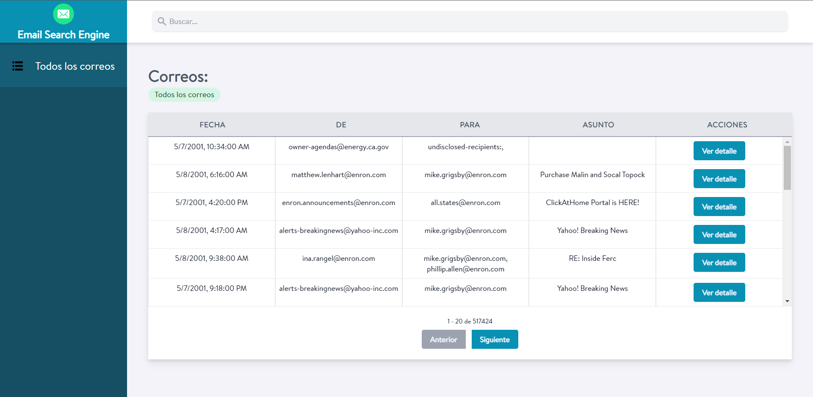

# email-search-engine

Este es un proyecto para busqueda rápida de correos electrónicos.



Utiliza Vue.js para el frontend y Go y ZincSearch para el backend.

Para correr el proyecto:

```
npm install
npm run dev
```

El backend se encuentra en el repositorio: https://github.com/Miguel219/email-search-engine-backend
